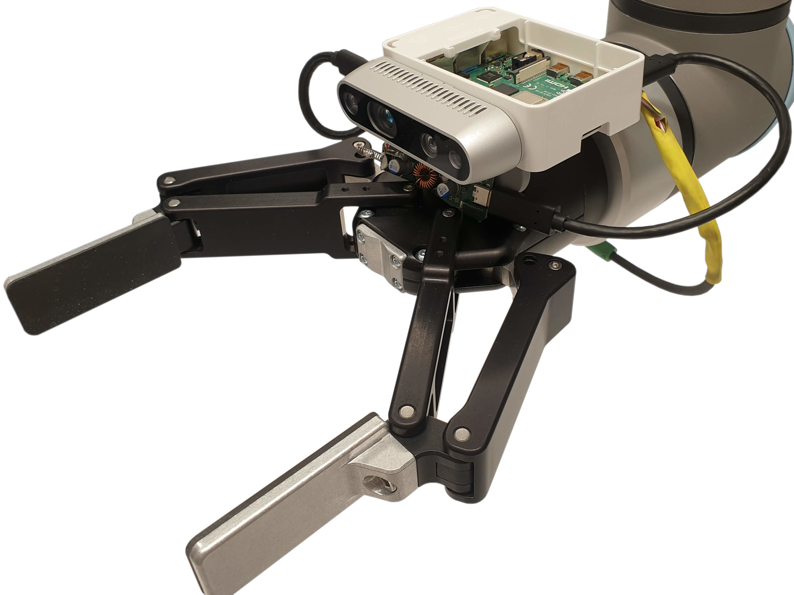
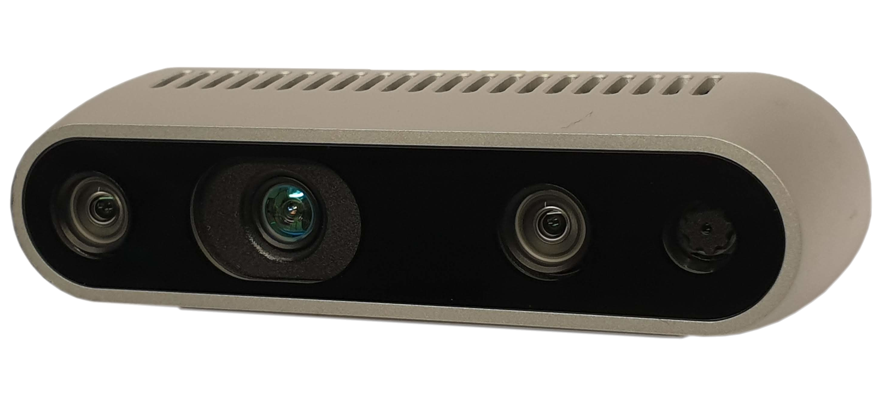
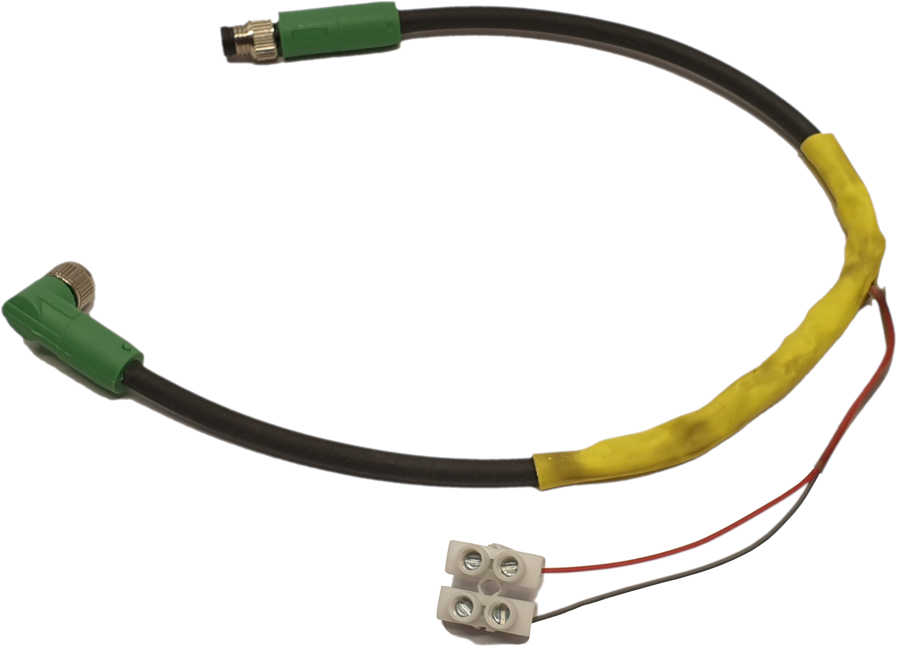
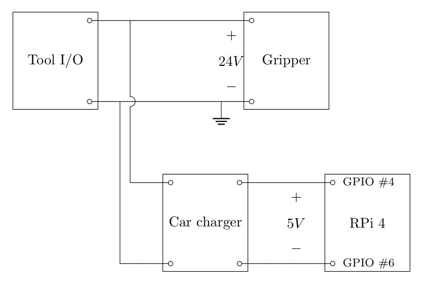
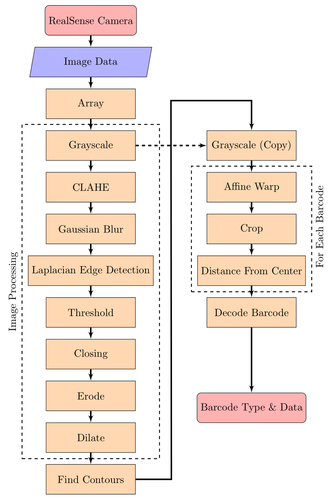

# Robotvision - A Machine Vision System for the Automated Lab

Extended Master's thesis project with the goal of developing a complete machine vision system for the _UR10e_-based automated biological lab. 
A combination of competent hardware and a robust software stack provide a solid basis for visual quality control for the lab.

## Installation

This project is designed to run on a Raspberry Pi 4, a device based on the ARM architecture. This means some adjustments are required before porting "regular" x86 code to the platform.

Most importantly, _pyrealsense2_, the python wrapper for the RealSense camera SDK needs to be built from source for ARM. All python packages are installed globally on the RPi instead of using a virtual environment.

All other dependencies are specified in the _requirements.txt_-file, and can be installed by

    pip install --requirement=requirements.txt

## Usage

The Flask server responsible for exposing internal methods is started by running

    python server.py

A startup script on the RPi takes care of this whenever the device reboots. This means the web server should always be running on adress _10.10.0.254:5000_. 

Once the service is running, camera requests can be made to the same IP declaring intention with a different endpoint:

### Barcode reading
Barcode recognition and decoding is done by sending a request to 

    10.10.0.254:5000/read_barcode
The endpoint returns the decoded information from the most central barcode in the cameras view, along with the particular barcode type.

The request can be modified to perform several image captures and computations, increasing the probability of reading the sought-after barcode correctly. This is done by adding another parameter:

    10.10.0.254:5000/read_barcode/<t>
Increasing _t_ increases the computation time since the request is repeated _t_ number of times before returning a result.

### Livefeed
To see what the vision system is currently viewing, visit the root index

    10.10.0.254:5000/
or

    10.10.0.254:5000/livefeed

in any browser. The system will capture 8 frames per second and update the content of the html continuously. 

## Repository overview

The development of this project is split into 7 stages:

1. Research and notes
2. Pose determination
3. RealSense camera
4. Reading barcodes
5. Generating barcodes
6. Image processing
7. Flask API programming
 
Content and code from each stage is kept in its own directory, archiving each component by itself before combining into the final `production/` code base. 

## Hardware

The vision system is based around the _Intel D435i Depth Camera_, a competent and developer friendly camera with lots of features for future expansion.
At this point, only its basic 1080p RGB camera sensor is used to capture images for processing.

Controlling the camera and processing the captured image data is a _Raspberry Pi 4 Model B 4GB_.
This microcomputer is powerful enough to perform image processing and hosting a small web server through which quality control data can be communicated to external systems.

The camera and RPi are mounted together in a case, attached to the gripper of the _UR10e_ robot arm with a 3D-printed mount. 
The 5V power required by the RPi is supplied by splicing the gripper power cable and separating its 24V and ground leads, after which the voltage is stepped down using a car charger/buck converter.

## Software

This project relies on

* _OpenCV_ and its _Python_ bindings for image processing.
* _NumPy_ for its data and image manipulation.
* _librealsense_ and more specifically _pyrealsense2_ for interfacing with the RealSense camera.
* _treepoem_ and _pyzbar_ for generating and decoding barcodes, respectively.
* _Flask_ is used to host a web server, exposing system methods for remote usage.

## Final Assembly Checklist

- [x] Intel D435i Depth Camera 
- [x] Raspberry Pi 4B
- [x] USB-C => USB-A 5Gbps [cable](https://noerdic.se/collections/adapter-usbc/products/type-c-to-usb-a-31-5gbps-3a-15cm-black-usbc-n1030)
- [x] 3D printed mount
- [x] M8 cable [extension](https://se.rs-online.com/web/p/industrial-automation-cable-assemblies/8582777) for power (Anders)
- [x] 3A car [charger](https://www.atea.se/eshop/product/estuff-stromadapter-for-bil/?prodid=2053528) ([Produktwebben](https://produktwebb.uu.se/inkop/W2ProductCatalog.aspx?prodId=9506694)) (Anders)
- [x] USB-C => USB-C power [cable](https://www.kopplat.se/Produkt/10222/USB-20-kabel-C-he-till-C-hane-svart-05-meter) (Rikard)
- [x] Network (Anders)
