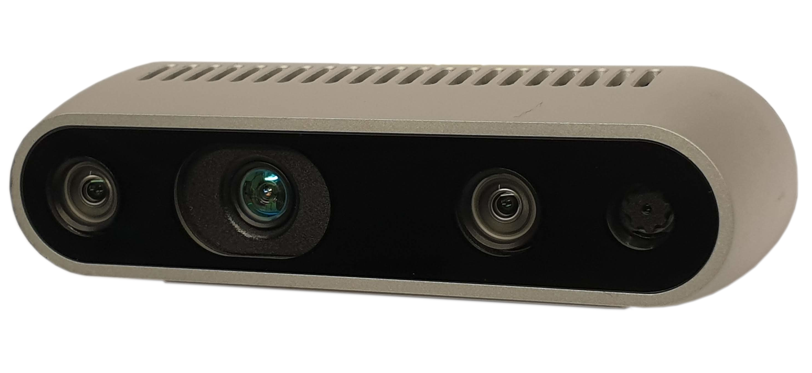
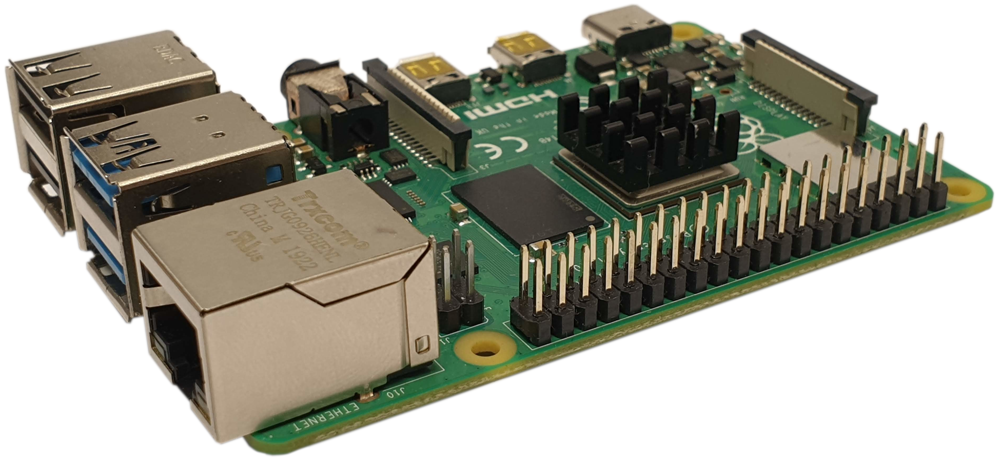
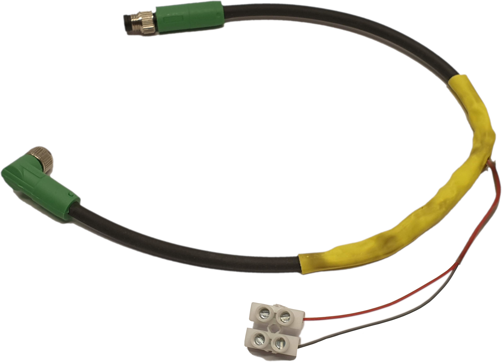

# Robotvision - A Machine Vision System for the Automated Lab

Extended Master's thesis project with the goal of developing a complete machine vision system for the _UR10e_-based automated biological lab. 
A combination of competent hardware and a robust software stack provide a solid basis for visual quality control for the lab.

## Installation

## Usage

## Repository overview

The development of this project is split into 7 stages:

1. Research and notes
2. Pose determination
3. RealSense camera
4. Reading barcodes
5. Generating barcodes
6. Image processing
7. Flask API programming
 
Content and code from each stage is kept in its own directory, archiving each component by itself before combining into the final `production/` code base. 

## Hardware

The vision system is based around the _Intel D435i Depth Camera_, a competent and developer friendly camera with lots of features for future expansion.
At this point, only its basic 1080p RGB camera sensor is used to capture images for processing.

Controlling the camera and processing the captured image data is a _Raspberry Pi 4 Model B 4GB_.
This microcomputer is powerful enough to perform image processing and hosting a small web server through which quality control data can be communicated to external systems.

The camera and RPi are mounted together in a case, attached to the gripper of the _UR10e_ robot arm with a 3D-printed mount. 
The 5V power required by the RPi is supplied by splicing the gripper power cable and separating its 24V and ground leads, after which the voltage is stepped down using a car charger/buck converter.

## Software

This project relies on

* _OpenCV_ and its _Python_ bindings for image processing.
* _NumPy_ for its data and image manipulation.
* _librealsense_ and more specifically _pyrealsense2_ for interfacing with the RealSense camera.
* _treepoem_ and _pyzbar_ for generating and decoding barcodes, respectively.
* _Flask_ is used to host a web server, exposing system methods for remote usage.

## Final Assembly Checklist

- [x] Intel D435i Depth Camera 
- [x] Raspberry Pi 4B
- [x] USB-C => USB-A 5Gbps [cable](https://noerdic.se/collections/adapter-usbc/products/type-c-to-usb-a-31-5gbps-3a-15cm-black-usbc-n1030)
- [x] 3D printed mount
- [x] M8 cable [extension](https://se.rs-online.com/web/p/industrial-automation-cable-assemblies/8582777) for power (Anders)
- [x] 3A car [charger](https://www.atea.se/eshop/product/estuff-stromadapter-for-bil/?prodid=2053528) ([Produktwebben](https://produktwebb.uu.se/inkop/W2ProductCatalog.aspx?prodId=9506694)) (Anders)
- [x] USB-C => USB-C power [cable](https://www.kopplat.se/Produkt/10222/USB-20-kabel-C-he-till-C-hane-svart-05-meter) (Rikard)
- [x] Network (Anders)